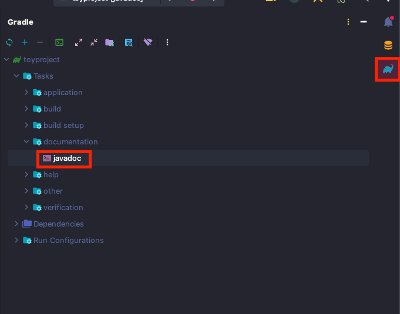
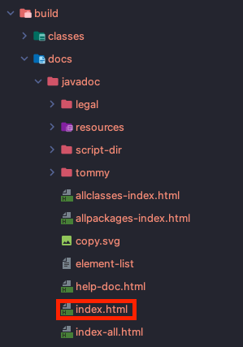
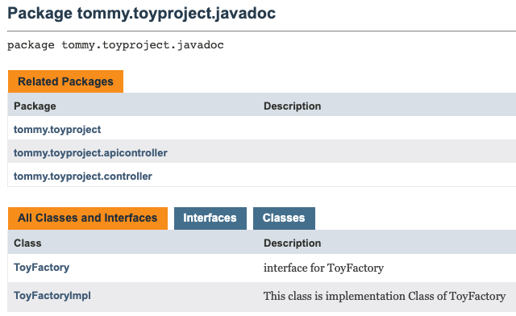
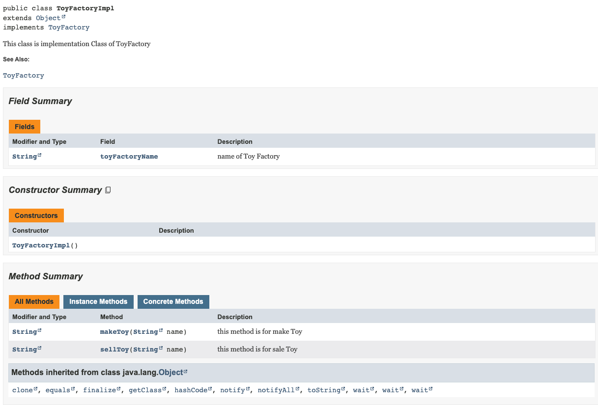

좋은 API 문서는 성공적인 Software Project를 위한 많은 요소들 중 하나이다. 

JDK의 최근 버전들은 모두 Javadoc 도구를 제공한다. 

*평소 우리가 프로젝트 하는 경우에 대해서는 모두 지원을 한다고 보면 될 것 같다.*

**[JavaDoc을 사용하기 위한 전제조건]**

1. JDK1.4 이상
2. PATH 환경 변수에 JDK의 /bin 폴더가 추가 되어 있는지 확인 
3. IDE (선택사항)


**[이번 Post에서 사용한 환경]**

1. JDK 17
2. IntelliJ
3. SpringBoot 3.0.4
4. Gradle 7.6.1

---

## Javadoc의 주석

java에서 사용할 수 있는 주석방식은 다음과 같다. 

```java
(1)
// single line comment

(2)
/*
 * regular multi-line comment
 */

(3)
/**
 * javadoc
 */
```

이중 javadoc을 사용하려고 하면 3번 주석을 사용해야 한다. 


### Javadoc 형식

Javadoc 주석은 문서화 하려는 Class 및 method 혹은 필드 위에 배치할 수 있다.

Javadoc 주석은 일반적으로 두가지 section으로 구성된다.

1. 우리가 문서화 하려는 것에 대한 설명 
2. 특정 메타 데이터를 설명하기 위해 @이 사용된 독립형 블록 태그


[Javadoc 예시]

```java
(1)
/**
 * This class is implementation Class of ToyFactory
 * @see tommy.toyproject.javadoc.ToyFactory
 * @author tommy
 */
public class ToyFactoryImpl implements ToyFactory{
		(2)
    /**
     * name of Toy Factory
     */
    public String toyFactoryName;
  
  	(3)
    /**
     * this method is for make Toy
     * @param name name of Toy
     * @return the name of toy
     */
    @Override
    public String makeToy(String name) {
        return name + "toy is made";
    }
		(4)
    /**
     * this method is for sale Toy
     * @param name name of Toy
     * @return Sentence for sold toy
     */
    @Override
    public String sellToy(String name) {
        return name + "toy was sold";
    }
}
```

(1)은 class를 설명하기 위한 Javadoc 예시이다. 

@see의 경우 참조를 가르키는 링크 혹은 텍스트 항목을 작성할 수 있는 독립형 블록 태그이다. 

@author의 경우 Javadoc comment를 작성한 사람을 적을 때 사용하는 것이다. 


(2)는 필드값을 설명할 때 사용한다. 


(3)과 (4) 는 method를 설명할 때 사용한다.

@param에는 메서드의 변수를 적으면 된다.

`작성 형식 : @param {변수명} {변수에 대한 설명}`

@return에는 메서드가 반환하는 것에 대해 설명을 적으면 된다.


이 외에 자주 사용되는 블록 태그는 다음과 같다. 

* since
  * 클래스, 필드 혹은 메서드가 프로젝트에 추가된 버전을 지정
* version
  * %I% 및 %G% 매크로와 함께 일반적으로 사용되는 소프트웨어 버전을 지정
* throws
  * 소프트웨어가 예외를 예상하는 경우를 설명하는데 사용 
* deprecated
  * 코드가 사용되지 않는 이유, 사용되지 않을 수 있는 시기 및 대안에 대한 설명 

### Javadoc 생성

> maven으로도 build를 할 수 있지만 이번 프로젝트는 gradle을 사용했기 때문에 gradle 내용만 알아보려고 합니다.
>
> 혹시 maven으로 build를 하시는 분은 [javadoc - StackOverFlow](https://stackoverflow.com/questions/9971219/generate-javadoc-html-using-maven)를 한번 확인해봐주세요


IntelliJ에서 우측에 보면 코끼리 아이콘이 있다. 이를 눌러준 후 [Tasks] -> [documentation] -> javadoc 실행



실행 후에 폴더 directory에서 [build] -> [docs] -> index.html 클릭을 하면 javadoc 문서를 확인할 수 있다.



[생성된 Javadoc 문서]






---

Reference

https://docs.oracle.com/en/java/javase/11/tools/javadoc.html

https://docs.oracle.com/javase/8/docs/technotes/tools/windows/javadoc.html
